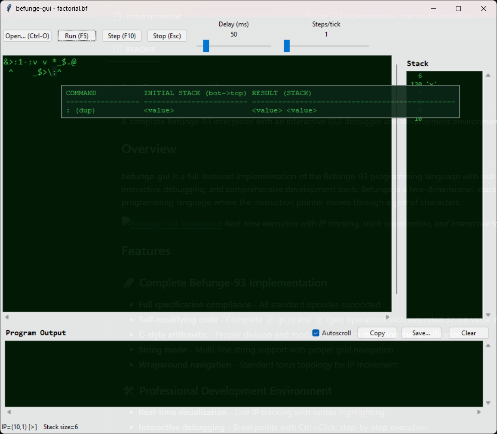

# befunge-gui

A complete Befunge-93 interpreter with an interactive GUI debugger and development environment.

## Overview

**befunge-gui** is a full-featured implementation of the Befunge-93 programming language with real-time visualization, interactive debugging, and comprehensive development tools. Befunge is a two-dimensional, stack-based esoteric programming language where the instruction pointer moves through a grid of characters.


*Real-time execution with IP tracking, stack visualization, and interactive tooltips*

## Features

### 🚀 Complete Befunge-93 Implementation
- **Full specification compliance** - All standard opcodes supported
- **Self-modifying code** - Complete `p` (put) and `g` (get) operations with extended 32-bit value storage
- **C-style arithmetic** - Proper division and modulo semantics matching the specification
- **String mode** - Multi-line string support with proper grid navigation
- **Wraparound navigation** - Standard torus topology for IP movement

### 🛠️ Professional Development Environment
- **Real-time visualization** - Live IP tracking with syntax highlighting
- **Interactive debugging** - Breakpoints with Ctrl+Click, step-by-step execution
- **Smart output window** - Dedicated output with live stack visualization and intelligent docking
- **Speed control** - Configurable execution speed (1-500ms) and batch processing (1-50 steps/tick)
- **Settings persistence** - Per-file configuration automatically saved as `.befmeta.json` sidecars

### 💡 Advanced GUI Features
- **Interactive tooltips** - Hover over any opcode for instant documentation with formatted tables
- **Professional keyboard shortcuts** - Complete hotkey support (F5 run, F10 step, Esc stop, Ctrl+O open)
- **Asynchronous I/O** - Non-blocking input handling for `&` and `~` operations
- **File validation** - Smart detection of Befunge files with helpful error messages
- **Window management** - Smart docking system that follows main window movement

## Installation & Usage

### Requirements
- Python 3.8+
- tkinter (usually included with Python)

### Quick Start

```bash
# Clone the repository
git clone https://github.com/yourusername/befunge-gui.git
cd befunge-gui

# Run with file dialog
python main.py

# Open a specific file
python main.py examples/hello.bf
python main.py program.befunge
```

### Supported File Formats
- `.bf` - Standard Befunge files
- `.befunge` - Alternative Befunge extension

## Usage Guide

### Basic Operations
- **F5** - Run program (opens output window)
- **F10** - Step through program one instruction at a time
- **Esc** - Stop execution
- **Ctrl+O** - Open file
- **Ctrl+Click** - Toggle breakpoint on any cell

### Development Workflow
1. **Open** a Befunge file or start with a blank grid
2. **Set breakpoints** by Ctrl+clicking on grid cells
3. **Adjust speed** using the delay slider (1-500ms between steps)
4. **Run or step** through your program while watching the stack and output
5. **Settings auto-save** per file for seamless workflow resumption

### Interactive Features
- **Hover tooltips** - Mouse over any character for opcode documentation
- **Live stack display** - Watch stack changes in real-time with ASCII character preview
- **Output management** - Copy, save, or clear program output with autoscroll control
- **Visual debugging** - IP position (mint green), breakpoints (orange-red), hover cells (dark green)

## Architecture

```
befunge-gui/
├── core/                      # Interpreter engine
│   ├── interpreter.py         # Main interpreter with extended storage
│   ├── InstructionPointer.py  # IP management and grid navigation
│   ├── stack.py              # Befunge-specific stack with zero semantics
│   ├── direction.py          # 2D movement system
│   ├── ops.py                # Opcode dispatch table
│   ├── types.py              # Enums and data structures
│   └── utils.py              # C-style arithmetic utilities
├── ui/                       # GUI components
│   ├── app.py                # Main application with smart docking
│   ├── opcode_hovertips.py   # Interactive tooltip system
│   ├── opcodes.py            # Opcode documentation and formatting
│   └── format_stack.py       # Stack visualization utilities
├── validate/                 # Input validation
│   └── validate_load.py      # File and content validation
└── main.py                   # CLI entry point
```

## Befunge-93 Language Support

### Complete Opcode Set

| Category | Opcodes | Description |
|----------|---------|-------------|
| **Arithmetic** | `+` `-` `*` `/` `%` | C-style arithmetic with proper truncation |
| **Comparison** | `` ` `` `!` | Greater-than and logical NOT |
| **Directions** | `>` `<` `^` `v` `?` | IP movement and random direction |
| **Conditionals** | `_` `\|` | Horizontal and vertical if statements |
| **Stack** | `:` `\` `$` | Duplicate, swap, pop operations |
| **I/O** | `.` `,` `&` `~` | Integer/character output and input |
| **Grid** | `g` `p` | Get and put for self-modifying code |
| **Control** | `#` `@` `"` | Bridge, halt, string mode |
| **Literals** | `0`-`9` | Push digit values |

### Advanced Features

**Self-Modifying Code with Extended Storage**
- Values 0-255: Stored directly in grid as characters
- Values outside 0-255: Stored in shadow dictionary with grid showing low byte
- Full 32-bit integer support while maintaining visual grid fidelity

**Intelligent Grid Management**
- Automatic padding to 80×25 minimum (Befunge-93 standard)
- Original program dimensions preserved for visualization
- Efficient updates with revision tracking

## Examples

### Hello World
```befunge
>25*"!dlroW ,olleH">:#,_@
```

### Factorial Calculator
```befunge
&>:1-:v v *_$.@ 
 ^    _$>\:^
```

### Self-Modifying Counter
```befunge
>91+0p>:91+0g1+91+0p.91+0g9`#@_^
```

## Development

### Per-File Settings (`.befmeta.json`)
Each Befunge file automatically gets a settings sidecar:
```json
{
  "version": 2,
  "delay_ms": 50,
  "steps_per_tick": 1,
  "breakpoints": [
    {"x": 0, "y": 0},
    {"x": 15, "y": 0}
  ]
}
```

### API Usage
```python
from core.interpreter import Interpreter

# Create interpreter
interp = Interpreter(">91+.@")

# Step through execution
while True:
    status = interp.step()
    if status != StepStatus.RUNNING:
        break

print(interp.output)  # "10"
```

## Technical Highlights

### Performance Optimizations
- **Incremental rendering** - Only updates changed grid regions
- **Batch processing** - Execute multiple steps per GUI update
- **Output streaming** - Efficient handling of large program output
- **Smart docking** - Minimal window repositioning calculations

### GUI Architecture
- **Event-driven execution** - Non-blocking with timer-based stepping
- **Resource management** - Proper cleanup and memory management
- **Error handling** - Graceful degradation with user feedback
- **Cross-platform** - Pure Python/Tkinter for maximum compatibility

## Contributing

1. Fork the repository
2. Create a feature branch (`git checkout -b feature/amazing-feature`)
3. Make your changes with tests
4. Commit your changes (`git commit -m 'Add amazing feature'`)
5. Push to the branch (`git push origin feature/amazing-feature`)
6. Open a Pull Request

### Development Setup
```bash
# Clone and setup
git clone https://github.com/yourusername/befunge-gui.git
cd befunge-gui

# Run tests (when available)
python -m pytest

# Run with development options
python main.py --help
```

## License

This project is licensed under the MIT License - see the [LICENSE](LICENSE) file for details.

## Acknowledgments

- [Befunge-93 Specification](https://catseye.tc/view/Befunge-93/doc/Befunge-93.markdown) by Chris Pressey
- The esoteric programming language community
- Contributors and testers who helped refine the implementation

## Alternatives

If **befunge-gui** doesn't meet your needs, consider these alternatives:
- **bef** - Command-line Befunge interpreter
- **cfunge** - High-performance C implementation
- **pyfunge** - Python Befunge-98 interpreter (different spec)
- **jefunge** - Web-based Befunge interpreter

---

*Built with ❤️ for the esoteric programming community*